__appAnálise__ v\. 1\.20

Guia de instalação

 _MUITO IMPORTANTE_ 

_PASSO 1_  __:__

O appAnálise é um  _software_  desktop que deve ser instalado e executado em computador que possua o sistema operacional Windows 10 atualizado \(a partir da versão 21H1\)\.

No MENU INICIAR deve ser executado o comando  _winver_ \, o que abrirá uma janela semelhante à apresentada ao lado\.

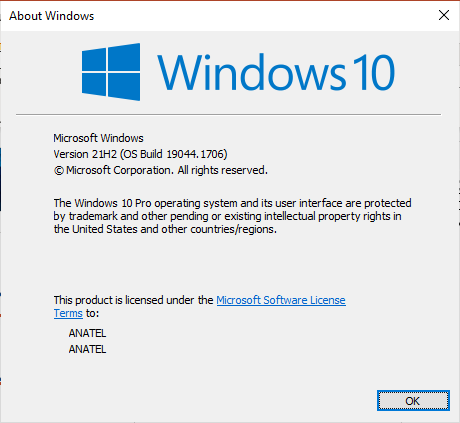

Se aparecer qualquer versão diferente de   _21H1_   ou   _21H2_  \, o Windows 10 precisará ser atualizado\, o que dependerá de senha de administrador\.

_PASSO 2_  __:__

As versões antigas do MATLAB Runtime devem ser desinstaladas\.

Deve ser executada a aplicação disponível no Painel de Controles do Windows que possibilita a desinstalação de  _softwares_ \.

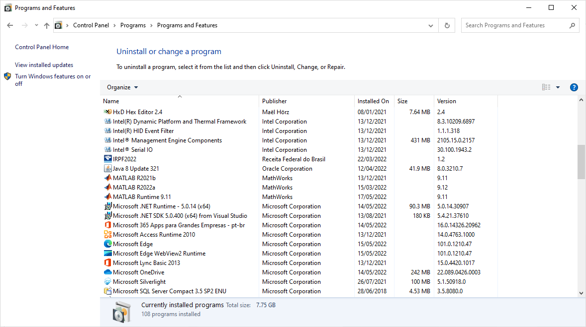

Devem ser desinstaladas todas as versões anteriores à MATLAB Runtime 9\.11\.

* _PASSO 3_  __:__
* Deve ser feito o  _download_  do instalável ou executável do appAnálise\, executando\-o posteriormente\.
  * [https://github\.com/EricMagalhaesDelgado/appAnalise/releases](https://github.com/EricMagalhaesDelgado/appAnalise/releases)
* Caso não exista instalado o MATLAB Runtime 9\.11 no computador\, o próprio executável do appAnálise o instalará \(no caso da versão  _standalone_ \)\.

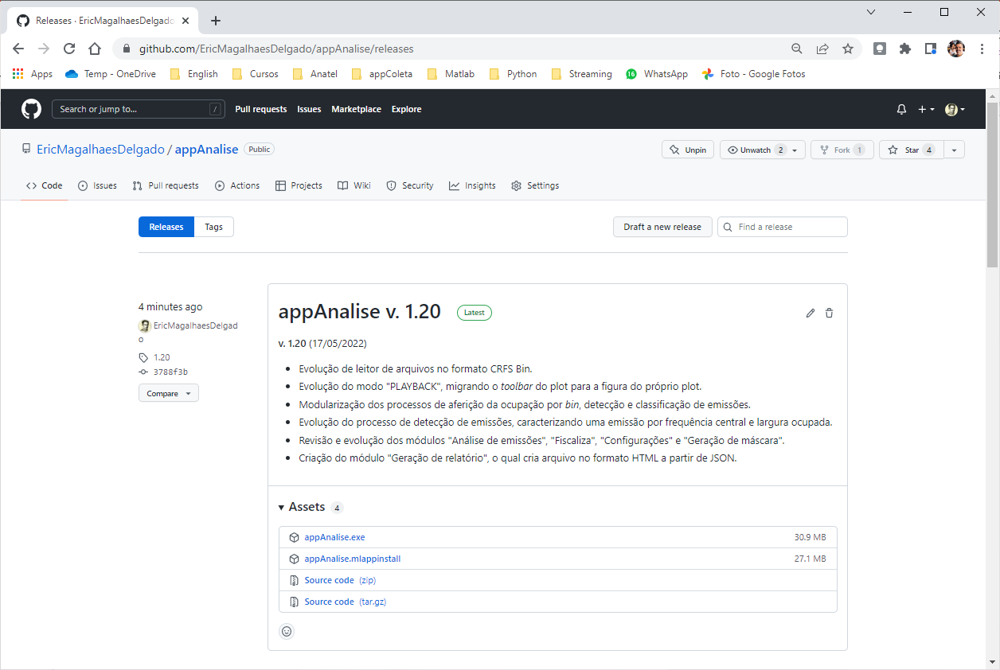

A versão instalável – no formato \.MLAPPINSTALL – é destinada a quem possui o MATLAB\.

A versão executável – no formato \.EXE – é destinada a quem não possui o MATLAB\. Nesse caso\, o appAnálise será executado sobre o MATLAB Runtime\.

 _MUITO IMPORTANTE_ 

_PASSO 4_  __:__

O cuidado com o PATH da instalação\.

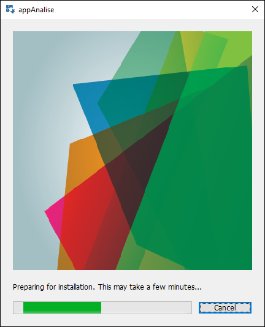

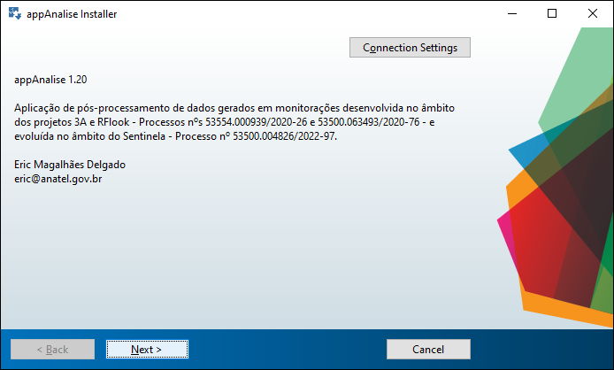

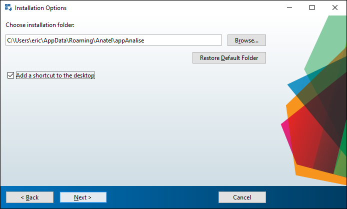

O login do administrador local dos computadores da Agência é “administrador”\. Ao instalar o appAnálise usando esse  _login_ \, o instalador sugerirá como PATH

“C:\\Users\\  _administrador_  \\Romaing\\Anatel\\appAnalise”\.Deve ser alterado o nome administrador para o nome do usuário\, de forma que o appAnálise seja instalado numa pasta em que o usuário tenha perfil de escrita\.

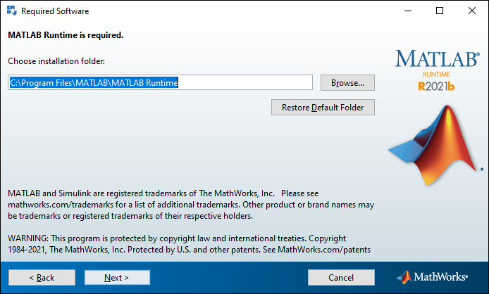

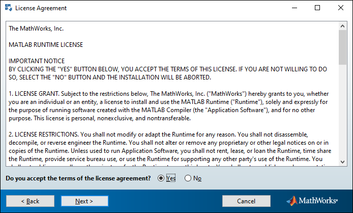

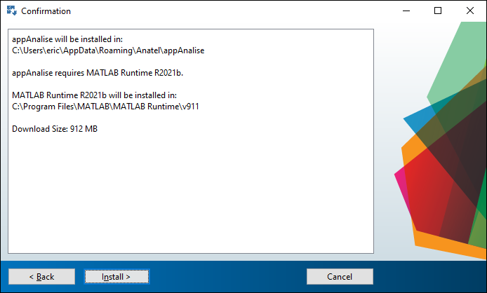

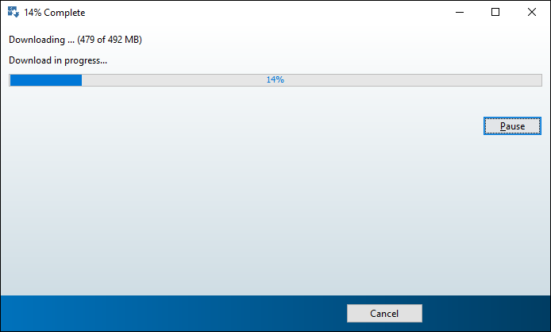

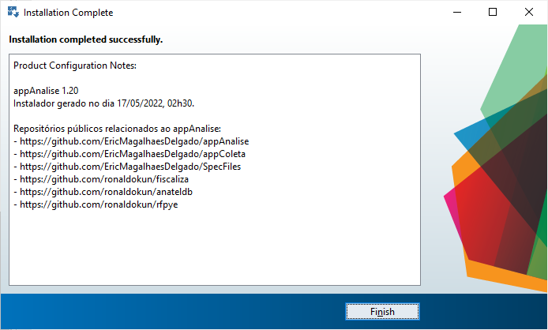

O MATLAB Runtime é instalado \(ou atualizado\) automaticamente\.

Uma conexão de banda larga possibilita uma instalação do MATLAB Runtime entre 20 e 30 minutos\.

 _MUITO IMPORTANTE_ 

* _PASSO 5_  __:__
* Instalação do Python e criação de ambiente virtual\. Recomenda\-se o ANACONDA\.
  * [https://repo\.anaconda\.com/archive/Anaconda3\-2022\.05\-Windows\-x86\_64\.exe](https://repo.anaconda.com/archive/Anaconda3-2022.05-Windows-x86_64.exe)
* O ANACONDA deve ser instalado numa pasta em que o usuário tenha perfil de escrita\.
  * A pasta padrão sugerida no instalador do ANACONDA é: “C:\\Users\\  __USUARIO__  \\anaconda3”
* Após a sua instalação\, deve\-se digitar no MENU INICIAR “ANACONDA”\, o que possibilitará executar o “ Anaconda Prompt”\.
* Posteriormente\, deve ser criado ambiente virtual no Python chamado “fiscaliza”\, o que ocorrerá ao executar os seguintes comandos:
* Caso o ANACONDA tenha sido instalado na sua pasta padrão\, o ambiente virtual será criado na seguinte pasta:
  * “C:\\Users\\USUARIO\\anaconda3\\envs\\fiscaliza”

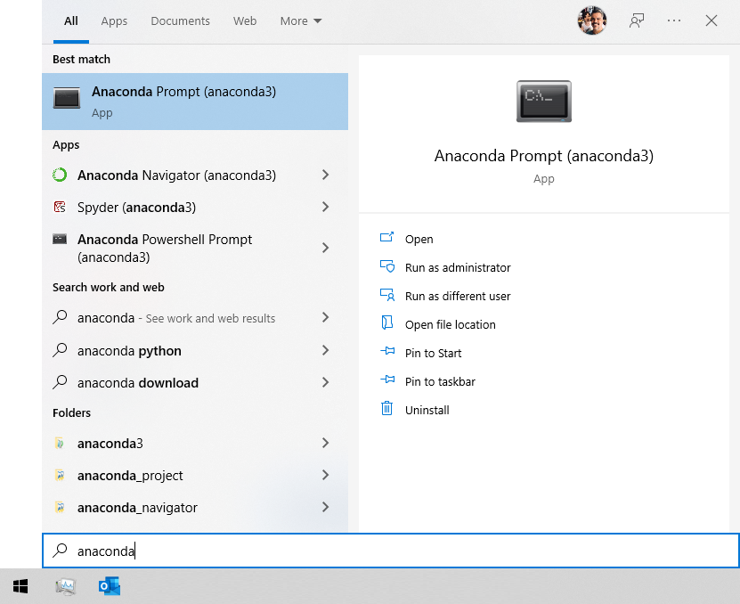

>> conda create –n fiscaliza python=3\.9

>> conda activate fiscaliza

>> pip install fiscaliza \-U

 _MUITO IMPORTANTE_ 

_PASSO 6_  __:__

Abre o appAnálise e mapeia o ambiente virtual criado no Python\.

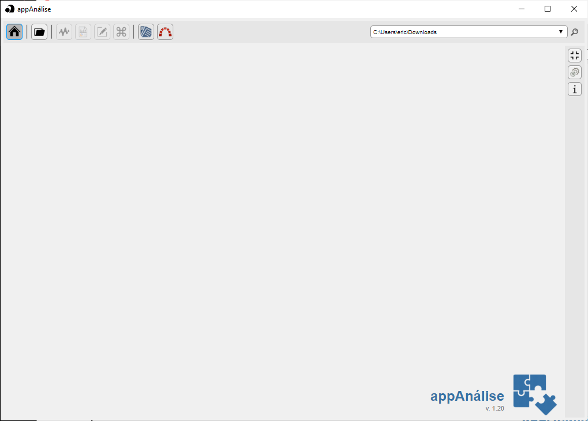

Clica na “engrenagem” do appAnálise\, depois no ícone do Python e\, por fim\, aponte para o python\.exe existente no ambiente virtual fiscaliza\.

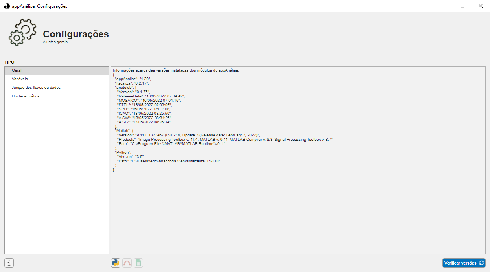

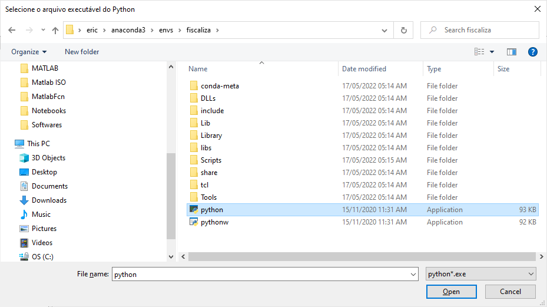

